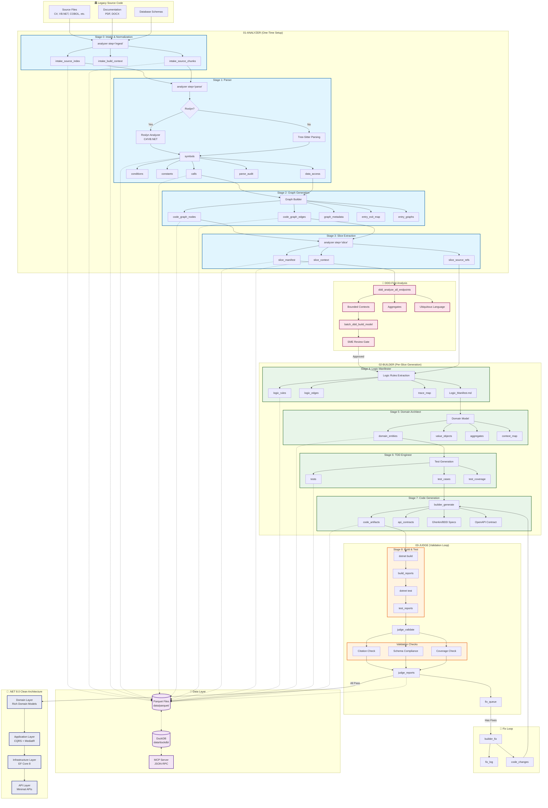

# Migration Agents - Architecture Diagram

This diagram shows the complete end-to-end workflow for the migration-agents pipeline.

## Workflow Overview

## Agent Responsibilities

| Agent | Stages | MCP Tools | Description |
|-------|--------|-----------|-------------|
| **01-analyzer** | 0-3 | `analyzer` (ingest/parse/slice) | One-time analysis setup |
| **02-builder** | 4-7 | `builder_generate`, `builder_fix`, `ddd_*` | Per-slice code generation |
| **03-judge** | 8+ | `judge_validate` | Validation with fix loop |

## Data Flow Summary

1. **Intake**: Legacy source → Parquet chunks with checksums
2. **Parse**: Tree-sitter/Roslyn → Symbols, calls, data access
3. **Graph**: Build call/data graphs → Entry/exit maps
4. **Slice**: Extract vertical slices by depth workflows
5. **DDD**: Analyze bounded contexts, aggregates, ubiquitous language
6. **Logic**: Extract business rules → Logic Manifest
7. **Domain**: Model entities, value objects, aggregates
8. **TDD**: Generate tests before code
9. **Code**: Generate .NET 8.0 Clean Architecture
10. **Judge**: Build, test, validate citations & coverage
11. **Fix Loop**: Auto-correct until all validations pass

## Storage Architecture

- **Parquet**: All artifacts stored as columnar data
- **DuckDB**: Read layer with views per table
- **MCP Server**: JSON-RPC interface for agent access
- **Per-run databases**: `data/duckdb/run_YYYYMMDDHHMMSS.duckdb`
